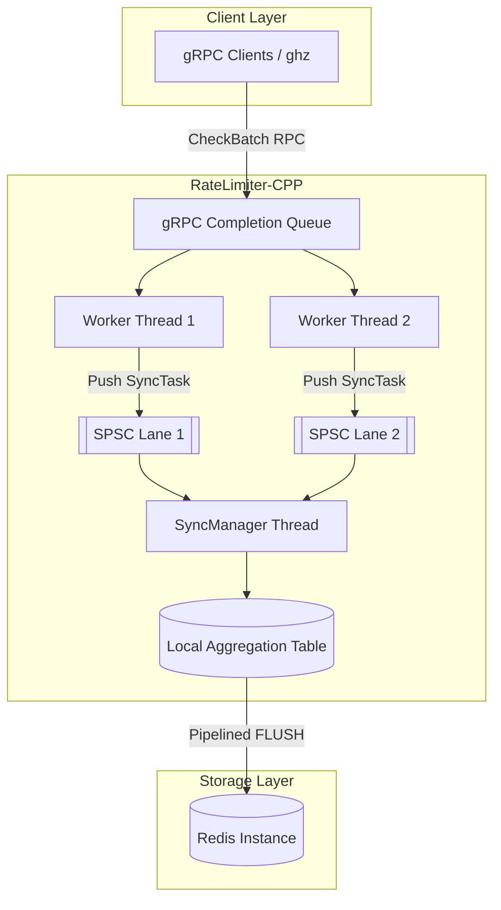

# RateLimiter-CPP

A high-performance, distributed rate-limiting service built with C++20 and gRPC. Designed to achieve massive throughput on legacy hardware through lock-free concurrency and asynchronous I/O with batching.

## 🚀 Performance Highlights

Validated on an Intel Core i3-540 (2 Cores, 4 Threads @ 3.06 GHz) during a 1-hour continuous burn-in test:

- **Peak Throughput:** 180,000+ user checks per second.

- **Low Latency:** ≈0.27 ms fastest response time.

- **Stability:** Stable 30MB RSS memory footprint (zero leaks).

- **Reliability:** 99.99% success rate over 450 million processed checks.

## 🏗 Architecture

#### Key Design Patterns

- **Asynchronous gRPC State Machine:** Utilizes the C++ CompletionQueue and a CallData lifecycle to handle thousands of concurrent streams without thread-per-request overhead.

- **Lock-Free SPSC Lanes:** Each worker thread possesses a dedicated Single Producer Single Consumer (SPSC) queue. This eliminates mutex contention when passing data to the synchronization layer.

- **Aggregated Redis Pipelining:** The SyncManager thread polls all lanes, aggregates increments in local thread-safe maps, and flushes to Redis using high-speed pipelines every 50ms.

- **Micro-Sleep Backpressure:** Replaced aggressive **yield** with calibrated **micro-sleeps** (100μs) to prevent core starvation on dual-core systems.

## 📊 Benchmarks

#### Throughput = Requests per Second (RPS) × Batch Size
|Batch Size	|Avg. RPS	|Total Users/sec	|Avg. Latency| p99 Latency|
|:----|----:|----:|----:|----:|
|10 Users|	~8,400|	84,000	|6.0 ms| ~18ms|
|50 Users|	~3,300|	165,000	|14.5 ms| ~42 ms|
|100 Users|	~1,800|	180,000	|27.5 ms|~85 ms|

## 🛠 Prerequisites
#### If running without docker:
1. gRPC & Protobuf: v1.50+
2. Redis: v6.0+
3. C++ Compiler: GCC 11+ or Clang 14+
4. Libraries: redis-plus-plus, hiredis
#### With docker:
1. Docker & Docker Compose

## 🔨 Build Instructions
#### Running with Docker (Recommended)
1.  Clone the repository:
    ```bash
    git clone https://github.com/harshal24-chavan/rate-limiter-cpp.git
    cd RateLimiter-CPP
    ```
2.  Start the service:
    ```bash
    docker compose up --build -d
    ```
3.  The gRPC server will be listening on `localhost:50051`.


#### manually
```Bash
mkdir build && cd build
cmake ..
make -j$(nproc)
```
#### using build script:
```Bash
chmod +x ./BUILD.sh && ./BUILD.sh
```
## ⚙️ Configuration

Rules are defined in `config.toml`. You can map specific endpoints to different strategies:

```toml
[redis]
host = "redis"
port = 6379

[server]
port = 50051

[[rules]]
endpoint = "/api/v1/login"
strategy_type = "token_bucket"
limit = 5
interval = 60 # seconds

[[rules]]
endpoint = "default"
strategy_type = "fixed_window"
limit = 100
interval = 3600
```
## 🧪 Running Benchmarks

Use ghz to stress-test the server. For the most stable results on dual-core hardware, use taskset to pin the server to specific cores.

#### Start the Server:
```Bash
cd build
taskset -c 0,1 ./RateLimiterServer
```

#### Run 50-User Batch Test:

```Bash

ghz --insecure \
  --proto ./proto/ratelimit.proto \
  --call ratelimiter.RateLimitService/CheckBatch \
  -D ./mid_data.json \
  -c 50 -z 30s \
  localhost:50051
```
## WorkFlow:


## ⚖️ License
This project is licensed under the **MIT License**. See the [LICENSE](LICENSE) file for the full text.

## Things to improve
[ ] 1. Redis doesn't have Time to Live (TTL) for any data.

[ ] 2. Implement token bucket algorithm.

[ ] 3. Improve code quality
